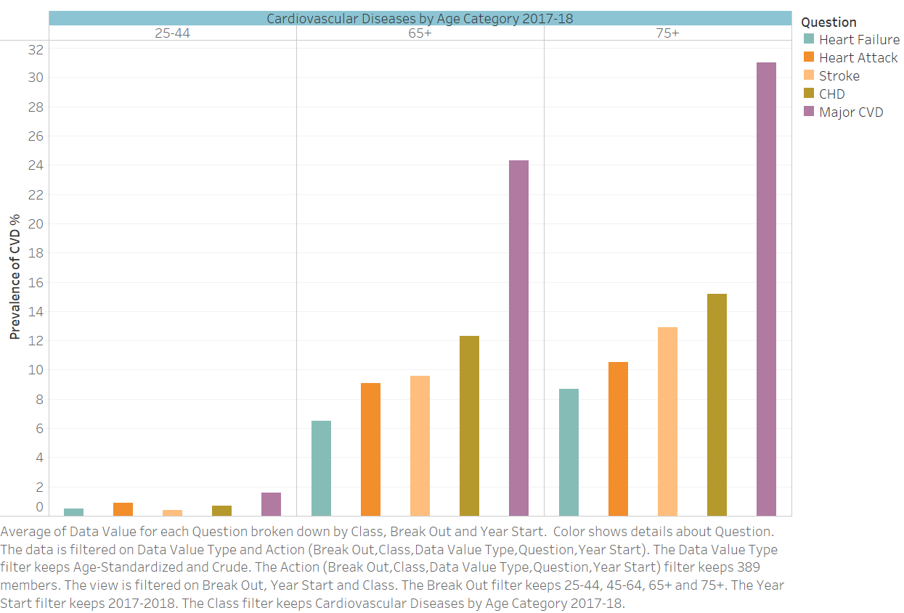
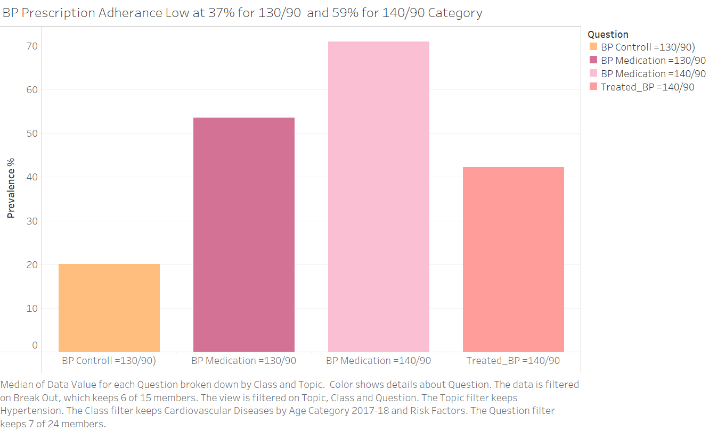
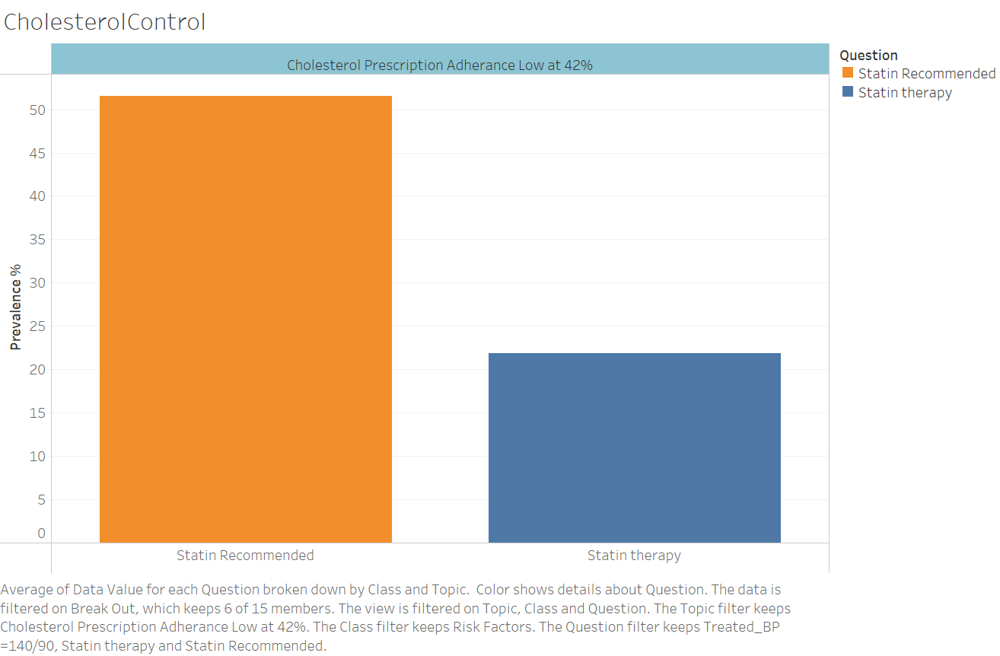

# Data Source and brief description of dataset
The National Health and Nutrition Examination Survey (NHANES) is a program of studies designed to assess the health and nutritional status of adults and children in the United States. 
The survey is unique in that it combines interviews and physical examinations. Indicators from this data source have been computed by personnel in CDC's Division for Heart Disease and Stroke Prevention (DHDSP). 
This is one of the datasets provided by the National Cardiovascular Disease Surveillance System. The system is designed to integrate multiple indicators from many data sources to provide a comprehensive picture of the public health burden of CVDs and associated risk factors in the United States.

[Cardiovascular Disease (CVD) Surveillance System](https://healthdata.gov/dataset/National-Health-and-Nutrition-Examination-Survey-N/5qtx-zbdc)

## [Data Table](https://github.com/odu-cs625-datavis/fall23-asv-arunthakurGithub/blob/df40836dfa38add02741af29a6edde7e329d1c4f/Cardiovascular_Disease_Prevalence_RiskFactors_Table_forPython.csv)

## Brief statement as to why you're interested in this topic
- Every year, Americans suffer more than 1.5 million heart attacks and strokes. 695,000 people in the United States died from heart disease in 2021—that's 1 in every 5 deaths
- Heart disease cost the United States about $239.9 billion each year from 2018 to 2019
- Half of US adults have hypertension (119.9 million), 37.3 million (11.3% )  people have diabetes, 25 million adults in the United States have total cholesterol levels above 240 mg/dL, More than 2 in 5 adults (42.4%) have obesity (underlying cause of CVD)
- Study shows Root Causes of illness are lack of physical activity and unhealthy diet
- I am interested in this topic because I have managed good health and disease free life so far till age 65 and feel that making everyone aware of this silent killer, its Risk Factors, Good Practices will help millions of people avoid or delay CVD
- Disease prevention through lifestyle change and adhering to treatment plan at the early stage can make all the difference

## Data Cleaning
Removed Column: Same Information captured in other columns
RowID, Year, QuestionID, BreakoutCode
LocationAbbr - US , all data is for US only
Removed Column “PriorityArea4”, all blank
Removed Column “Data_Value_Footnote”, all blank
Removed 1136 rows with: “Data not available” in Data_Value_Footnote Column P
Statistically unstable estimates are suppressed, based on the NCHS Data Presentation Standards for Proportions: Parker JD, Talih M, Malec DJ, et al. National Center for Health 
Balance rows 3988

# What is CVD, Why does it develop, Who is likely to get it, When and How to prevent it 
1. Cholesterol deposits form plaques in the heart's arteries
2. Plaque ruptures to form blood clot
3. Clot blocks blood flow, causing a heart attack, a lack of blood flow causes the tissue in the heart muscle to die
4. Similarly clot in brain ateries leads to Stroke

## Risk Factors
- Total Cholesterol above 190
- Blood Pressure above 120/80
- Diabetes HbA1C above 5.6
- High Salt Consumption above 2400 mg / day
- Smoking
- Obesity

**Attributes provide a comprehensive picture of the public health burden of CVDs and associated risk factors in the United States**
- From Year 1999 to 2017
- Age Group
- Gender
- Race/Ethnicity
- Class: Cardiovascular Diseases, Risk Factors 

**Topic**
1. Major Cardiovascular Disease
2. Acute Myocardial Infarction (Heart Attack) 
3. Cholesterol Abnormalities 
4. Coronary Heart Disease 
5. Diabetes 
6. Heart Failure 
7. Hypertension
8. Nutrition
9. Obesity
10. Smoking
11. Stroke

**24 Survey Questions**
1. Mean dietary sodium intake (mg/day) among US adults (18+)
2. Mean serum total cholesterol among US adults (20+) - Million Hearts Healthy People 2030
3. Prevalence of acute myocardial infarction (heart attack) among US adults (20+)
4. Prevalence of blood pressure control among US adults (18+) with hypertension (BP =130/90)
5. Prevalence of blood pressure control among US adults (18+) with hypertension (BP =140/90)
6. Prevalence of cholesterol screening in the past 5 years among US adults (20+)
7. Prevalence of coronary heart disease among US adults (20+)
8. Prevalence of current smoking among US adults (20+)
9. Prevalence of diabetes among US adults (18+)
10. Prevalence of heart failure among US adults (20+)
11. Prevalence of hypertension (BP =130/90) among US adults (18+)
12. Prevalence of hypertension (BP =140/90) among US adults (18+)
13. Prevalence of hypertension awareness among US adults (18+) with hypertension (BP =130/90)
14. Prevalence of hypertension awareness among US adults (18+) with hypertension (BP =140/90)
15. Prevalence of hypertension medication use among US adults (18+) with hypertension (BP =130/90)
16. Prevalence of hypertension medication use among US adults (18+) with hypertension (BP =140/90)
17. Prevalence of hypertension medication use among US adults (18+) with hypertension (BP =140/90)
18. Prevalence of obesity among US adults (20+)
19. Prevalence of prehypertension (BP 120/80 - 129/80) among US adults (18+)
20. Prevalence of prehypertension (BP 130/80-139/89) among US adults (18+)
21. Prevalence of recommended statin therapy for cholesterol management among US adults (20+)
22. Prevalence of severe hypercholesterolemia (LDL-C =190) among US adults (20+)
23. Prevalence of statin use among US adults (20+) for whom statin therapy is recommended
24. Prevalence of stroke among US adults (20+)

## CVD Time Bomb set to explode after 65

CVD Magnitude - 25m Patients, One in Three affected by CVD at 75

idiom/mark/data/encode table for the final chart (see Markdown Code for Table)
Idiom: Bar Chart / Mark: Line
| Data: Attribute | Data: Attribute Type  | Encode: Channel | 
| --- |---| --- |
| Prevalence % |  value, quantitative | vertical spatial region (y-axis) |
| Age Category | key, categorical  | horizontal position on a common scale (x-axis) |

Chart shows that CVD Bomb is a silent killer set to explode after the age of 65 when it is too late to avoid Heart Attack or Heart Failure. 
It answers the Questions - What is CVD, Why does it take place. Who is likely to get it and When. How to prevent it.

## Final Thoughts

There was a great personal learning through this project. I always thought that I have a healthy regimen and hence low risk profile for CVD. But, with the data of high prevlence for 65+ Age category I felt that I 
need to be extra careful and follow the prescription for Cholesterol, Blood Pressure and Diabetese without fail otherwise CVD is waiting to strike.
Identification of stakeholeders - Patients, Pharma Companies, Payers (Insurance Companies) and Physicians. It has been a constant challenge for the Physicians and Pharma Companies to improve prescription adherance.
It requires huge communication and awareness campaign to change the myths in Patient's mind about the side effects of the medicines which leads to low prescription adherance. At the same time, Payers (Health Insurance Compenies) are very keen to implement strategies to prevent CVD through lifestyle change and prescription adherance as it brings down the cost of treatment by 20 to 30 times by avoiding the hospitalization and 
surgery for millions of patients.

Keeping in mind the importance of Prescription Adherance I have made additional graphs to show the need of prescription adherance and its benefits.

**References**      
(https://www.ncbi.nlm.nih.gov/pmc/articles/PMC6288566/)      
(https://millionhearts.hhs.gov/data-reports/factsheets/ABCS.html)     
(https://www.heart.org/)        
(https://www.nhlbi.nih.gov/)       
(https://pubmed.ncbi.nlm.nih.gov/)      
(https://www.onlinejacc.org/)       
(https://www.mayoclinic.org/diseases-conditions/heart-attack/symptoms-causes/syc-20373106)       
(https://www.mayoclinic.org/diseases-conditions/coronary-artery-disease/symptoms-causes/syc-20350613)         
(https://www.nhsinform.scot/illnesses-and-conditions/heart-and-blood-vessels/conditions/cardiovascular-disease/)                 
(https://www.youtube.com/watch?v=TqNjk2td3-g)             
(https://www.mayoclinic.org/diseases-conditions/stroke/symptoms-causes/syc-20350113)                 
(https://www.cdc.gov/heartdisease/facts.htm)                
(https://www.heart.org/en/health-topics/high-blood-pressure/understanding-blood-pressure-readings)                 
(https://www.mayoclinic.org/diseases-conditions/high-blood-pressure/in-depth/high-blood-pressure/art-20046974)                   
(https://www.ncbi.nlm.nih.gov/pmc/articles/PMC2812791/#:~:text=The%20prevalence%20of%20fatty%20streaks,%2Dyears%2Dof%2Dage)                  
